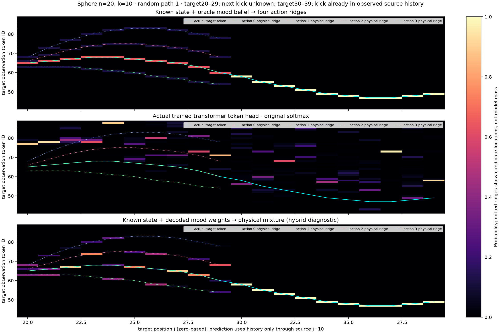

# k=10: are four physical probability ridges present in the token heatmap?

This packet addresses uncertainty about the **next unseen kick**, visible as coherent alternative token curves over consecutive target positions. It preserves the actual trained transformer's probabilities and compares them with explicit physical branch distributions on the same saved 500-token randomized-start paths.

## Timing

The supplied heatmap's model has **n=20** (kick spacing) and **k=10** (prediction offset). These are different quantities. Indices here are zero-based, as in the original source-position plot. Every target j is predicted using observations only through source j−10.

| Target positions | Available source positions | Kick at 20 |
|---|---|---|
| 20–29 | 10–19 | Not yet observed: four possible next actions |
| 30–39 | 20–29 | Already in observed history: the known-state oracle resolves the realized action |

If kicks instead occurred every 10 observations, target15 would use history through source5 and cross the unseen kick at10; targets16–19 would similarly permit four continuations. That is the user's proposed scenario. The saved k10 model uses 20-observation spacing, so it must retain its actual timing rather than silently changing the dynamics.

## The three heatmaps



1. **Known state + oracle mood belief:** exact state at the source is forked into four next-action continuations. Their weights are `predictive_mood_belief @ emission_matrix`. This produces the expected four ridges while the horizon crosses the unseen kick. The oracle knows the hidden action history and physical state; it is stronger than a predictor given only quantized tokens.
2. **Actual trained transformer:** unchanged original softmax probabilities. Dotted colored lines identify physically possible branch locations; their presence does not mean the model assigns probability there. Cyan is the actual target token.
3. **Known state + decoded mood weights:** the frozen projected linear mood readout supplies action weights; exact physics supplies branch locations. This is a hybrid diagnostic, not the transformer's native token head. Native token inference uses context310; the mood probe uses context320, as documented in the preceding packets.

Four possible moods do not require four equally high-probability bins. Probability sums to one, and distinct physical actions can land in the same observation bin, in which case their masses must be added. Each mood emits all four actions, with its own action having probability 0.95 here; the mood distribution must first be mapped through that emission matrix.

## Results

There are 240 source positions per path where k10 crosses a new kick. Across the four paths:

- **95.52%** of those positions have four distinct physical target bins.
- Oracle action probabilities range from **0.1114 to 0.6657**: the ridges need not have equal brightness.
- The actual trained token head places only **10.78%** probability mass on the union of those physical candidate bins, on average.

The expected branch geometry is therefore visible in the oracle comparison, while the actual trained model poorly matches it on these randomized-start paths. The prior weak generalization finding remains; this plot does not manufacture four modes in the learned output. Four paths and one training seed are diagnostic evidence, not a population-level result. Uncertainty about the physical state from quantized observations can also broaden a token-only predictor beyond four discrete bins.

## All paths

| Path | 500-token overview | Kick20 close-up |
|---|---|---|
| 1 | [Overview](path_1_500_tokens.png) | [Close-up](path_1_kick20_zoom.png) |
| 2 | [Overview](path_2_500_tokens.png) | [Close-up](path_2_kick20_zoom.png) |
| 3 | [Overview](path_3_500_tokens.png) | [Close-up](path_3_kick20_zoom.png) |
| 4 | [Overview](path_4_500_tokens.png) | [Close-up](path_4_kick20_zoom.png) |

## Verification

All 26 runtime source files and both input packets' hashes were checked. Replay reproduces all 500 observations. Every actual target is in its physical candidate set; without an intervening kick, all four copies give the same target. Halving integration dt to 0.0025 preserves all candidate bins. Mixtures combine duplicate bins and sum to one. `verify.py` independently reconstructs mixtures and scores and verifies that native probabilities are byte-for-byte equal as arrays to their saved values.

The staging CPU rendering/replay job used a 12-GiB cap, no swap and a 180-second limit; it completed in 6.863 seconds with 269.1 MiB peak memory. No model training, new inference, readout fitting or GPU rental was needed.

`ridge_arrays.npz` retains raw probabilities, branches, state/history alignment and action weights. `summary.json` and the two hash manifests preserve lineage and checks.

```sh
python verify.py
python generate.py --source /path/to/immutable/source \
  --token-input ../token-heatmaps-500-random-start --mood-input ../mood-heatmaps-500-k10 \
  --snapshot ../results/SOURCE_SNAPSHOT.json --output /path/to/new-output
```
