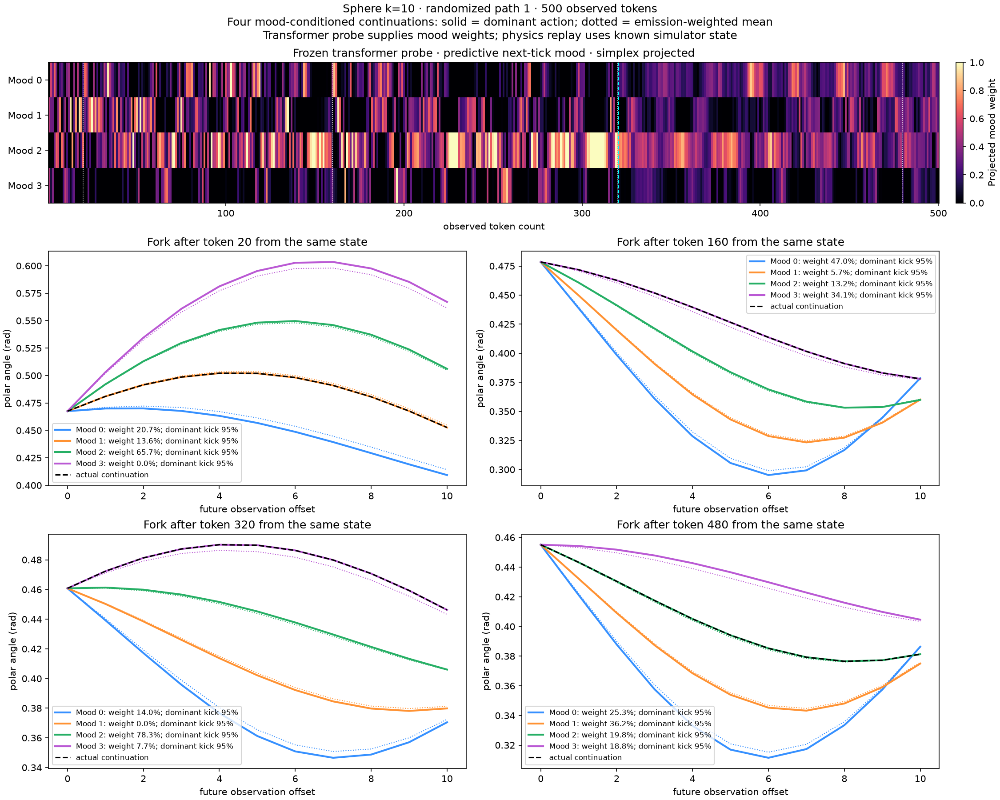

# Four-mood heatmaps and conditional trajectories over 500 Sphere tokens

This packet follows the **Mood 0–3 belief heatmap** reference. It does not select the transformer's top four observation bins. It uses the saved **k=10** Sphere model, four previously generated randomized-start paths, and the same all-four-block linear mood probe protocol as the original campaign.

## Combined views

The top panel is a four-row mood heatmap over **500 observed tokens**. Four snapshots below it fork the **same physical state** into four mood-conditioned continuations over the next **10 observations**. Snapshot locations (after tokens 20, 160, 320 and 480) were fixed before inspecting the plots.

- **Heatmap:** predictive belief about the *next HMM tick's mood*, decoded from transformer activations, then projected onto the probability simplex. The transformer has an observation-token head; these mood estimates come from a linear probe, as in the reference image.
- **Solid curves:** the most probable action for each mood. Here alpha=0.95, so Mood i emits action i with 95% probability; the other three actions each have probability 0.05/3.
- **Dotted curves:** the emission-weighted mean across all four action continuations for that mood. A conditional mean need not itself be a physically realizable path.
- **Legend weights:** the frozen trained probe's projected weight for each mood. A zero-weight mood remains visible as a conditional possibility. These projected values are not established calibrated probabilities.
- **Black dashed curve:** actual continuation. **Cyan vertical line:** sliding context begins after 320 observations. White dotted lines mark the four forecast snapshots.

The physical trajectories use the **known simulator state and known dynamics**. The transformer supplies decoded mood weights; it does not directly generate these continuous paths or independently estimate the physical state. All four mood-conditioned future distributions retain the full emission mixture in the saved arrays and separate future heatmap.



[Path 2](path_2_moods_and_trajectories.png) · [Path 3](path_3_moods_and_trajectories.png) · [Path 4](path_4_moods_and_trajectories.png)

## Oracle and matched-random comparisons

[All four paths at token resolution](mood_heatmaps_500_tokens.png) compares oracle, trained and matched-random readouts. [Tick-end comparisons](mood_heatmaps_tick_ends.png) use one estimate at the end of each 20-token tick, giving 25 ticks rather than the original 16. The oracle conditions on hidden action letters, so it is not the exact posterior conditioned only on observed tokens.

The original probe was fitted at **tick ends**. The 500-column view applies that frozen readout at every observation; intermediate phases are an additional extrapolation. Use the tick-end comparison for the matching probe phase. Starts were randomized with Gaussian jitter sigma=0.1 about the fixed training state; the saved model was not trained on these randomized starts. This is a 500-token trajectory evaluated with a maximum **320-token sliding context**, not a model with native 500-token attention. The mood probe uses all 320 positions because its original fit included the final tick; the earlier k-ahead token-head plots used 310 directly supervised positions.

## Validity and limitations

The original readouts were not persisted, so they were reconstructed using the **original 2048 fixed-start evaluation trajectories**, duplicate-history grouped splits and original selected ridge penalties. Both original held-out R² scores were reproduced exactly. The readouts were then frozen: none of the 500-token random-start observations or mood labels entered the fit. Trained and matched-random weights, source/configuration and saved input hashes were checked. All 26 runtime source files match the immutable training snapshot.

| Metric | Trained | Matched random |
|---|---:|---:|
| Original held-out raw belief R² | 0.651939 | 0.370714 |
| Randomized 500-token paths, tick-end raw belief R² | -0.417055 | -0.382443 |
| Same paths, tick-end projected belief MSE | 0.068780 | 0.075070 |
| All-position raw rows with an entry outside [0,1] | 74.85% | 70.00% |

The long randomized-path results show weak generalization. Simplex projection makes the heatmaps displayable but does not establish calibration, enforce the predictive mood bounds [0.1,0.7], or repair negative raw R². Four evaluation trajectories and one training seed do not establish population-level reliability.

Every fork replays the actual future exactly when its realized action is selected. Reference integration at dt=0.0025 gives **100% forecast token agreement**, with maximum polar-angle difference **7.52e-9 radians**. Forecast distributions sum to one; actions landing in the same observation bin have their probability masses combined. All future distributions, conditional means, residual features, probe coefficients, raw/projected estimates and original inputs are retained in `mood_arrays.npz`.

CPU jobs used staging-entity, a 12-GiB limit, no swap and finite runtime limits. Probe reconstruction/evaluation peaked at 796.9 MiB; rendering peaked at 163.5 MiB. No transformer training or GPU rental was launched.

## Files and reproduction

- `mood_probabilities.csv`: all 2000 path/position rows, including oracle and trained/random raw/projected values for all four moods.
- `mood_arrays.npz`: complete numerical data, frozen probe weights/features and four-mood/action forecast mixtures.
- `four_mood_future_heatmaps_path1_token320.png`: one conditional future distribution for each of the four moods, from the same state after token 320.
- `summary.json`: experiment/source/configuration/weight provenance, seeds, protocol and numerical checks.
- `REMOTE_SHA256.json` and `SHA256.json`: producer and published-packet hashes.

```sh
# NumPy only; checks all exported numbers against the saved arrays.
python verify.py

# Existing CPU environment with NumPy, Torch, sklearn and Matplotlib.
# The diagnostic helper and snapshot are in ../results/.
python generate.py --source /path/to/immutable/source --models /path/to/preserved/models \
  --input ../token-heatmaps-500-random-start --diagnostics ../results/diagnostics/analyze.py \
  --snapshot ../results/SOURCE_SNAPSHOT.json --output /path/to/new-output
# Place render.py alongside the new output arrays before rendering combined panels.
python render.py --input ../token-heatmaps-500-random-start
```

The prior top-four-token packet remains published as a separate diagnostic; these are the requested **four-mood** views.
