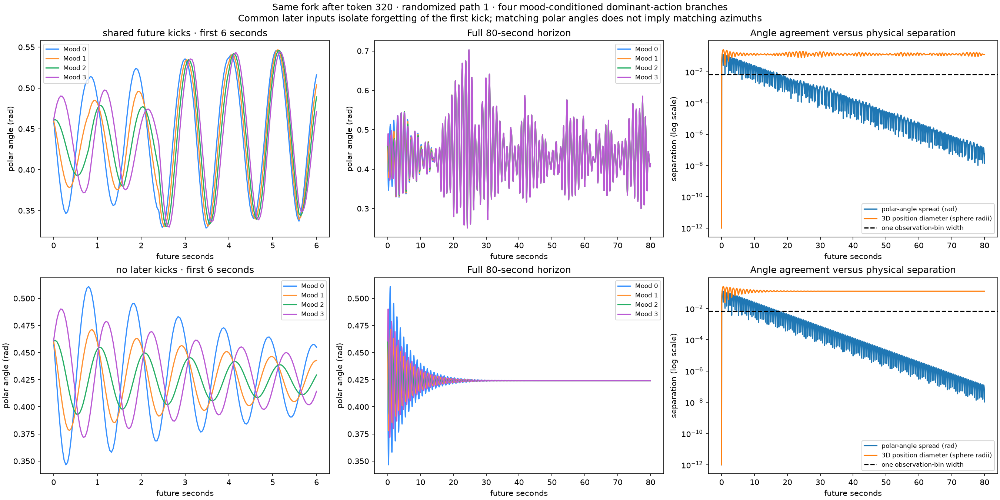

# Four mood-conditioned forks extended to 2000 future observations

The previous 10-observation forks are extended to **2000 observations / 80 seconds**, from the same four randomized paths and four fixed snapshots (after tokens 20, 160, 320 and 480). No transformer training, readout fitting, model inference or GPU rental was needed.

Each of the four initial branches uses its mood's dominant next action (95% emission probability at alpha=0.95), retaining the previously decoded mood weights. To ask whether the effect of that first action is forgotten, later forcing must be specified. Two explicit controls are shown:

1. **Shared future kicks:** all four branches receive the same later action sequence, every 20 observations. The sequence extends the original chain sample with the same seed 20261005; its first 25 ticks exactly match the saved input. Only the initial fork differs.
2. **No later kicks:** each branch receives its initial action, then relaxes under the original damped Sphere dynamics without further impulses.

These are physics continuations under specified future inputs. They are **not** a newly trained 2000-step transformer prediction or a marginalization over all future HMM action sequences. Independently drawn future kicks need not make four sample paths meet. The frozen transformer probe supplies the initial mood weights only.

## Convergence in the observed angle



The representative plot is the same preselected fork after token 320 on path 1. The left column resolves the initial six seconds; the middle covers all 80 seconds. The right column separates polar-angle agreement from 3D physical-position agreement.

| Future forcing | Polar-angle spread stays below one bin after | All four quantized tokens remain identical after | Final polar-angle spread | Final 3D position diameter |
|---|---:|---:|---:|---:|
| Same later kicks | 446 observations / 17.84 s | 1675 observations / 67.00 s | 5.86e-8 rad | 0.127887 sphere radii |
| No later kicks | 431 observations / 17.24 s | 509 observations / 20.36 s | 1.06e-8 rad | 0.128282 sphere radii |

“Stays below” means for every remaining sampled point through the 80-second endpoint, with at least 101 samples remaining. It is not a claim about infinite time. A transient crossing is not counted as lasting agreement. One observation-bin width is `(1.25−0.05)/180 = 0.0066667` radians. Even a smaller separation can straddle a rounding boundary, explaining why permanent integer-token agreement occurs later.

Across all 16 initial forks, polar-angle spread remains below one bin after **14.92–20.08 seconds** with common later kicks and **16.32–18.44 seconds** without later kicks. The full per-fork results are in `convergence.csv` and `summary.json`.

The angle curves converge, but **the physical trajectories do not fully merge**: azimuth differences persist. The source dynamics damp meridional motion while conserving vertical angular momentum, and the four meridional kicks start with the same vertical angular momentum. The plots directly measure residual 3D position separation; agreement in the observed polar angle does not establish equality of full states.

## All paths and snapshots

| Path | Same later kicks | No later kicks |
|---|---|---|
| 1 | [Four snapshots](shared_future_kicks_path_1.png) | [Four snapshots](no_later_kicks_path_1.png) |
| 2 | [Four snapshots](shared_future_kicks_path_2.png) | [Four snapshots](no_later_kicks_path_2.png) |
| 3 | [Four snapshots](shared_future_kicks_path_3.png) | [Four snapshots](no_later_kicks_path_3.png) |
| 4 | [Four snapshots](shared_future_kicks_path_4.png) | [Four snapshots](no_later_kicks_path_4.png) |

The original [500-token mood heatmaps and initial probe weights](../mood-heatmaps-500-k10/README.md) remain unchanged. Their projection/calibration and one-training-seed limitations apply.

## Checks and reproduction

- All 26 runtime source files and saved input hashes match the immutable training source/preceding packet.
- The first 10 future observations exactly reproduce the previous forks; recorded inputs reproduce all 500 original observations.
- Both long controls have no sampled polar/rate contacts or observation-range clipping.
- Halving the integration step from 0.005 to 0.0025 gives **100% token agreement** for both controls. Maximum polar-angle discrepancy is 1.013e-7 radians with common kicks and 1.837e-8 radians without later kicks.
- Raw four-dimensional physical states, quantized observations, initial weights, complete common-action histories, angular spreads and 3D separation are saved in `long_horizon_arrays.npz`. CSV values and sustained-agreement indices are independently checked against these arrays.
- The staging-entity CPU job had a 12-GiB cap, no swap and a 600-second limit; it used 17.579 seconds of CPU time and peaked at 227.3 MiB.

```sh
python verify.py  # NumPy only; published packet in its original directory layout
python generate.py --source /path/to/immutable/source \
  --mood-input ../mood-heatmaps-500-k10 --token-input ../token-heatmaps-500-random-start \
  --snapshot ../results/SOURCE_SNAPSHOT.json --output /path/to/new-output
```

`REMOTE_SHA256.json` records producer hashes; `SHA256.json` covers the published packet. These finite simulations support the displayed conditional convergence; they do not establish calibrated long-horizon model forecasts.
