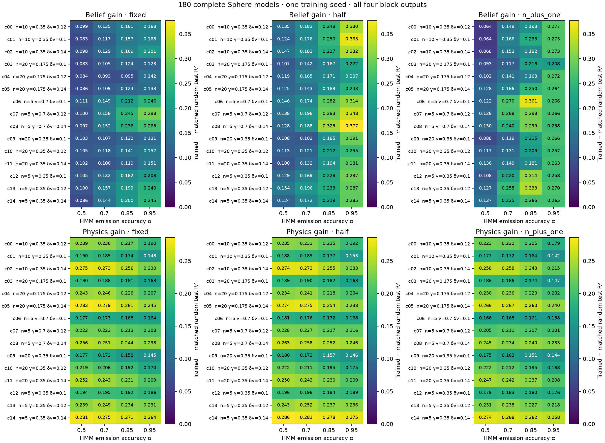
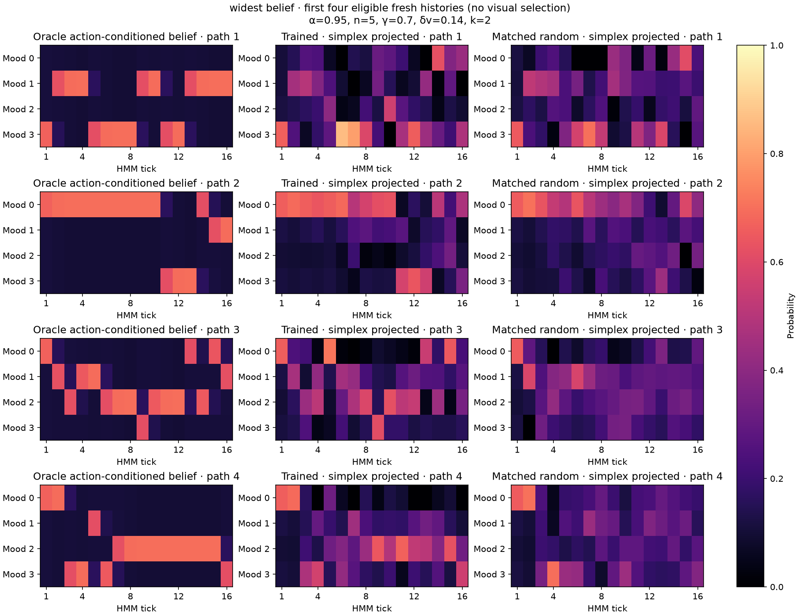
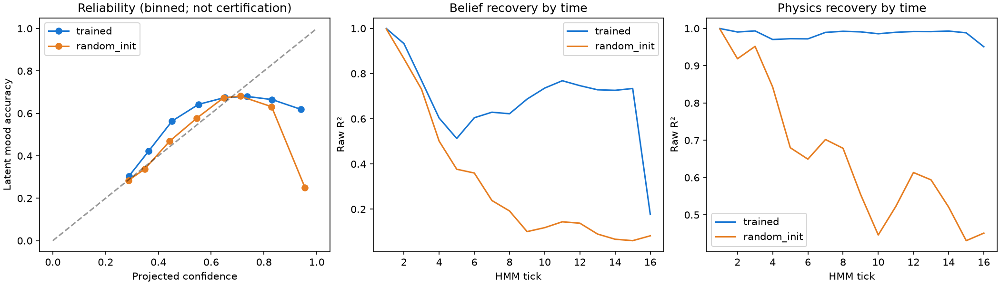

# Sphere polar: 180 complete 700M-token runs and validity diagnostics

Hypothesis `H-R2-05-polar-ladder-capacity`; training source `dc80726a8c987e8c3a9171299dac00d03a074311`. Results exported and diagnosed on 2026-10-02. These are the new polar 180-run results, separate from the old interrupted 540-run campaign.

## Scope and completion

Exactly 15 physical settings × 4 HMM emission accuracies × 3 prediction horizons, seed 0 only. Architecture: d128, four layers, two attention heads, MLP512, vocabulary 181. Every model saw **699,924,480 actual tokens** (700,000,000 requested). Each trajectory has 16 HMM ticks; n is physics samples per tick. Sampling interval is 0.04, internal integration step 0.005, damping γ, impulse strength δv, HMM stay probability 0.7. α is emission accuracy, **not** the ridge penalty or transition persistence. Initial physical state is fixed.

All 180 models and matched saved random states were independently hash-verified; all 2160 probe rows agree numerically with their model metadata. GPU training and both bounded CPU queues exited successfully. Instance 53547015 was released and independently found absent with zero volumes. Conservative cost estimate including prior and transfer reserves: $11.66 of the $20 cap; final provider invoice was not reconciled. The 360 partial snapshots are preserved separately and are not counted as complete models.

## Largest trained–random gaps

Primary comparison: **all four block outputs at one token per HMM tick**, 512 features. R² is averaged uniformly across four raw belief probabilities or two tangent velocities. All rankings use the completed original held-out evaluation; no readout selection across layers is used to inflate these entries.

| Target | Setting | Trained R² | Matched random R² | Gain |
|---|---|---:|---:|---:|
| Belief | α=0.95, n=5, γ=0.7, δv=0.14, half / k=2 | 0.683651 | 0.306593 | +0.377059 |
| Physics | α=0.5, n=5, γ=0.35, δv=0.14, half / k=2 | 0.991153 | 0.705251 | +0.285902 |

The smallest belief gap is α=0.5, n=10, γ=0.35, δv=0.1, n_plus_one / k=11: 0.256544 versus 0.192587, gain +0.063957. The full-grid mean belief gain is +0.183001 (0.447156 vs 0.264155); physics gain is +0.215230 (0.981888 vs 0.766658). All 180 improve on their matched random control in this primary readout. This is across-setting evidence from one training seed, not a seed-variance result.



## Independent fresh-data checks

The three representative cases above were selected after inspecting the grid. The original evaluation used seed 20260929, 2048 trajectories and duplicate-full-history-grouped 60/20/20 fit/validation/test splits. The ridge penalty was chosen on validation only. For these cases, the original scores were reproduced **exactly** from verified weights.

The same fitted readouts were then frozen and evaluated on a new 2048-trajectory batch, seed 20261002. Any full token history present anywhere in the original batch was removed: 17 at the belief winner, zero in the other cases. No fitting, penalty selection or winner selection used fresh test labels. Sampling is independent of pretraining seeds; exact history non-overlap with the streamed pretraining corpus cannot be audited because that corpus was not retained.

| Selected case / target | Fresh trained R² | Fresh random R² | Gain | Paired trajectory bootstrap 95% interval |
|---|---:|---:|---:|---:|
| Belief winner / belief | 0.685892 | 0.316597 | +0.369296 | [0.364060, 0.374599] |
| Physics winner / physics | 0.992477 | 0.707261 | +0.285216 | [0.278351, 0.292252] |
| Smallest belief gap / belief | 0.257357 | 0.191223 | +0.066134 | [0.061580, 0.071256] |

500 bootstrap resamples keep all ticks and trained/random predictions of a trajectory together. Intervals describe evaluation sampling only; they do not estimate training-seed variance, correct for selecting among 180 settings, or establish the fresh full-grid ranking.

Additional checks:

- Verified source/configuration/weight hashes for both model types in all three cases.
- Oracle labels are finite, sum to one, and agree with the exact HMM filter on the sampled letters. Physics labels and saved predictions are finite.
- Changing future tokens produced zero change in earlier residuals, in every checked model. Full token histories are disjoint across original splits and between original/fresh batches. Early causal prefixes recur across splits (100% at the earliest ticks); full-history grouping does not imply prefix disjointness.
- Independently shuffled fit and validation labels yield fresh belief R² from −0.0075 to +0.0022 and physics R² from −0.0063 to +0.0203, far below trained recovery. These are one deterministic shuffle per case, not a permutation significance test.
- A current-observation-bin plus tick-number baseline, without history, scores belief 0.179479 and physics 0.655656 at the belief winner; at the physics winner, belief 0.090417 and physics 0.656386.
- Fresh k-ahead token cross entropy improves from random 5.351483 to trained 0.751350 nats at the belief winner and from 5.355972 to 1.145430 at the physics winner. Horizons differ; cross-horizon loss is not directly comparable.

## Probability and temporal validity: limitations found

These are **linear decodings of an oracle action-conditioned belief**, not the transformer's native output probabilities and not the exact posterior conditioned only on observation tokens. Hidden letters are withheld from the transformer. Observation aliasing can therefore limit recoverable oracle information.

At the belief winner, 14.251% of trained raw prediction rows have a component outside [0,1]; extremes are −0.566656 and 1.061170. The maximum sum-to-one error is 0.010283. The heatmaps explicitly use Euclidean simplex projection, while primary R² retains the original raw predictions. Projection improves belief R² to 0.697550, but does **not** certify calibration.

Projected latent-mood Brier score (sum over four classes; lower is better) improves from random 0.673963 to trained 0.585157; mood classification accuracy improves from 44.27% to 61.25%. However, projected log loss is **worse**: trained 1.517847 vs random 1.353323 nats, with log probabilities floored at 1e−12. Rare zero/overconfident estimates matter. Raw predictive mood probabilities also violate the known [.1,.7] bounds implied by this HMM's transition matrix; even a valid simplex vector need not be a valid predictive mood belief. These checks establish useful decoding, not calibrated posterior probabilities.



The four plotted histories are the first four eligible fresh histories, not visually selected successes. Equivalent plots are included for the physics winner and smallest belief gap.

Time-resolved recovery exposes a terminal weakness: at the belief winner, trained belief R² drops from **0.733987 at tick 15 to 0.176681 at tick 16**. At the weakest belief case, tick 15 is −0.018687 despite positive pooled R². Terminal token features are not directly supervised by the k-ahead loss because the final k token positions have no in-sequence prediction target; that is a possible explanation, not a tested causal attribution. Pooled R² can conceal this behavior.



## Files and reproduction

- `probe_results.csv`: all 2160 original probe rows; `campaign_summary.json`: full-grid summaries.
- `metadata/`: exact JSON members extracted from the 180 verified model bundles, with hashes. Includes immutable recipe, architecture, losses, random/weight hashes, environment and probe protocol.
- `FINAL_ARTIFACT_VERIFICATION.json`, `FINAL_LOCAL_VERIFICATION.json`, `PROVIDER_CLEANUP_VERIFIED.json`: completion/integrity evidence.
- `diagnostics/gap_ranking.csv`: 360 primary paired comparisons; JSON reports, PNG figures and held-out prediction arrays preserve the diagnostic measurements.
- `source_snapshot.zip` and `SOURCE_SNAPSHOT.json`: exact minimal dependency source from the training revision, preserved as an artifact rather than changing this branch's active model code.
- Full weight/random ZIPs remain preserved locally and on staging; they are intentionally not placed in Git. Their member and archive hashes are in the verification records. Published prediction arrays contain synthetic trajectories only.

Run the portable export check from this folder:

```sh
python3 verify_exports.py
```

To repeat the bounded diagnostics, unpack `source_snapshot.zip` into an empty source directory, supply the preserved completed model files, and use an existing NumPy/Torch/scikit-learn/Matplotlib/Pandas/IPython environment:

```sh
python diagnostics/analyze.py --source /path/to/source --self-check
python diagnostics/analyze.py --source /path/to/source --models /path/to/completed-models --csv probe_results.csv --output /path/to/diagnostics
python /path/to/diagnostics/check_predictions.py
```

Copy `check_predictions.py` into the output directory for the last command. The measured CPU environment and script digests are in the diagnostic JSON. Jobs ran on staging with 12 GiB maximum memory, no swap and a finite runtime; no training or paid capacity was added.

**Acceptance:** process/artifact completion passed. Scientific acceptance remains limited by one training seed, fixed initial states, post-hoc selection of three diagnostic cases, incomplete probability calibration, recurring early prefixes, and terminal belief weakness. No claim of an exact token-conditioned posterior or general acceptance is made.
