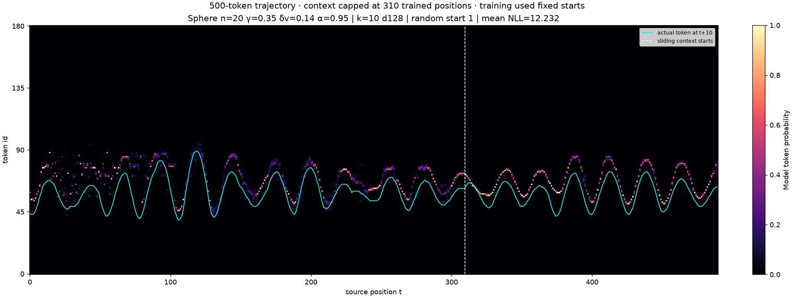
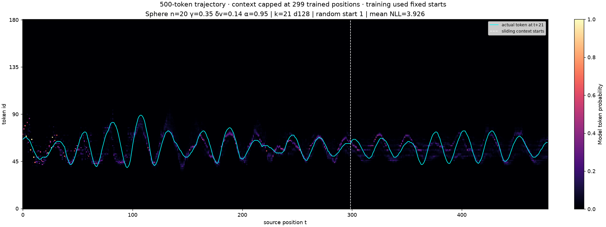
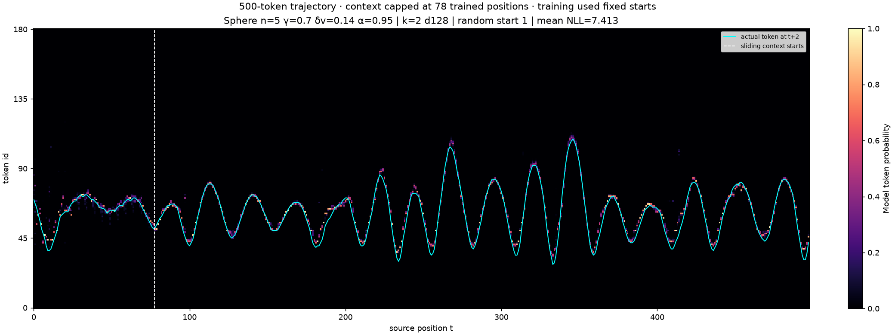

# Sphere token probability heatmaps: 500 tokens and randomized starts

Generated 2026-10-05 from three saved d128/four-layer/two-head/MLP512 models, training seed 0. This is frozen-model CPU evaluation. No new training or GPU rental was launched.

These heatmaps show **native softmax probabilities over the 181 observation tokens**, matching the supplied predator/prey examples. They use no belief readout or probability projection. The cyan line is the **actual token at t+k**, and NLL is computed with stable log-softmax at that exact target. A 500-token path yields 500−k scored source positions.

## Long trajectories and random starts

Each path has **500 observation tokens** (20 seconds at dt=0.04, internal RK4 step 0.005). There are four randomized paths per model, plus four paired fixed-start paths. All paths are retained; the previews show path 1 without selecting visually successful examples.

Initial coordinates are `(theta, psi, dtheta, dpsi)`. The existing `InitialStateConfig(mode="random", jitter_std=0.1)` adds independent Gaussian jitter around `(0.6, 0, 0, 2)`, bounds the polar angle and rates, and wraps azimuth. Angles are in radians and rates in radians/second. This is bounded local randomization, not uniform coverage of the whole state space. The archived polar simulator lacks coordinate-name metadata; a metadata-only view supplies it to the existing sampler without changing the dynamics.

Initial-state seed: 20261006. HMM/action seed: 20261005. Fixed/random pairs have **identical HMM letters**. All initial states, actions, tokens, probabilities and per-token NLLs are saved in the NPZ files.

The saved models were trained on **fixed starts and 16-tick sequences**, with maximum lengths 320 or 80. Each heatmap therefore uses a causal prefix followed by a **sliding window**, with positional indices reset in each window. The dashed line marks this boundary. Window size is `n_ctx−k`, using positions directly supervised by the original k-ahead loss; the original final k positions had no prediction target. These are not models trained with native 500-token context or random starts.

## Scores

Mean NLL in nats over all four paths and source positions; lower is better. Uniform token prediction has NLL 5.198. Different k values predict different horizons, so scores should be compared with the matching control, not used as a controlled cross-horizon ranking.

| Model | n | k | Sliding window | Trained / fixed start | Trained / random start | Random model / random start |
|---|---:|---:|---:|---:|---:|---:|
| long_context_k10 | 20 | 10 | 310 | 3.590 | 11.526 | 5.415 |
| long_context_k21 | 20 | 21 | 299 | 2.456 | 3.760 | 5.406 |
| belief_winner_k2 | 5 | 2 | 78 | 4.972 | 7.541 | 5.325 |

The randomized-start test exposes weak generalization. At k=10, trained NLL is 11.526 versus matched random 5.415. Even before sliding starts, its fixed-start NLL is 1.105 while randomized-start NLL is 9.936. At k=21, trained randomized-start NLL is 3.760 versus random 5.406. The former belief-decoding winner (k=2) has randomized-start token NLL 7.541 versus random 5.325, despite often looking close to the cyan trace. Concentrated probability on a neighboring wrong bin can look convincing while giving poor NLL.

Fixed-start performance also deteriorates when sliding begins: k=10 NLL rises from 1.105 to 7.871; k=2 rises from 0.707 to 5.765. Initial-state generalization and sliding-window/position-reset effects should be kept separate. Four trajectories and one training seed do not establish population-level or causal conclusions.

## Heatmap gallery

### Longer-context Sphere, k=10

n=20, damping gamma=0.35, impulse delta_v=0.14, HMM emission alpha=0.95. Original training length 320, usable window 310.



[Path 2](long_context_k10_random_start_2.png) · [Path 3](long_context_k10_random_start_3.png) · [Path 4](long_context_k10_random_start_4.png) · [Matched control panels](long_context_k10_controls.png)

### Same physical setting, k=21

Original training length 320, usable window 299.



[Path 2](long_context_k21_random_start_2.png) · [Path 3](long_context_k21_random_start_3.png) · [Path 4](long_context_k21_random_start_4.png) · [Matched control panels](long_context_k21_controls.png)

### Earlier belief-decoding winner, k=2

n=5, damping gamma=0.7, impulse delta_v=0.14, HMM emission alpha=0.95. Original training length 80, usable window 78.



[Path 2](belief_winner_k2_random_start_2.png) · [Path 3](belief_winner_k2_random_start_3.png) · [Path 4](belief_winner_k2_random_start_4.png) · [Matched control panels](belief_winner_k2_controls.png)

## Validity and reproduction

All probability arrays are finite, nonnegative and sum to one. Saved probabilities at the true t+k token agree with exp(−NLL); exported mean scores and top-1 accuracy agree with the arrays. Script, source/configuration and trained/random weight hashes were checked. All 26 runtime source files match the immutable training snapshot at `dc80726a8c987e8c3a9171299dac00d03a074311`.

Both start modes in all cases have **zero observation-bin clipping and zero sampled polar/rate-limit contacts**. Halving integration dt to 0.0025 gives **100% token agreement**; maximum polar-angle discrepancy is below 1e−7 radians. These checks validate the sampled synthetic paths; they do not rescue poor prediction performance.

`summary.json` and the per-case JSON contain complete recipes, environments, initial conditions, physics checks and scores. `SHA256.json` hashes the packet. The CPU run used a 12-GiB cap, no swap, and a finite runtime, peaking at about 537 MiB.

Using an existing NumPy/Torch/Matplotlib environment and the preserved models/source:

```sh
python plot_tokens.py --source /path/to/source --self-check
python plot_tokens.py --source /path/to/source --models /path/to/models --output /path/to/new-output
```

For verification, place `plot_tokens.py` and `verify.py` alongside the generated artifacts and run:

```sh
python verify.py
```

The immutable source snapshot is in [the original results packet](../results/SOURCE_SNAPSHOT.json), alongside its ZIP. Full weights remain preserved outside Git. This packet adds evaluation artifacts; the original 180-run scores retain their original protocol and acceptance limits.
