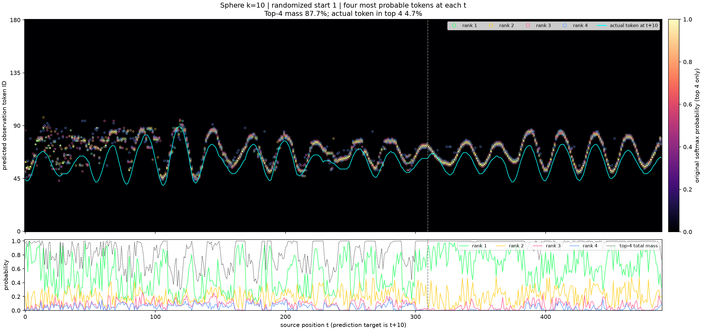
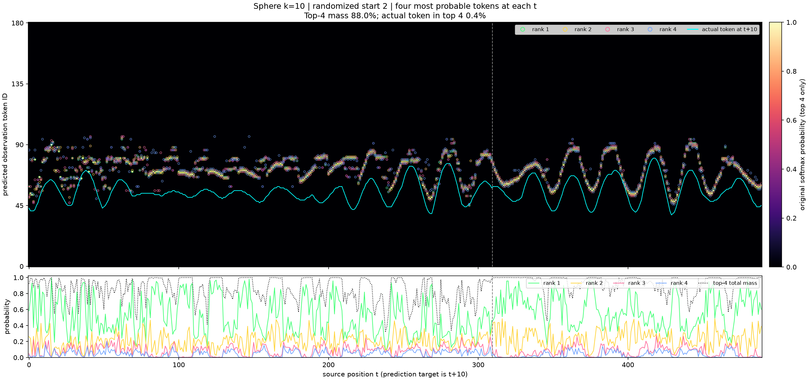
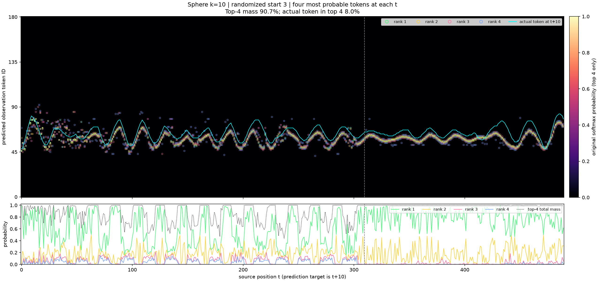
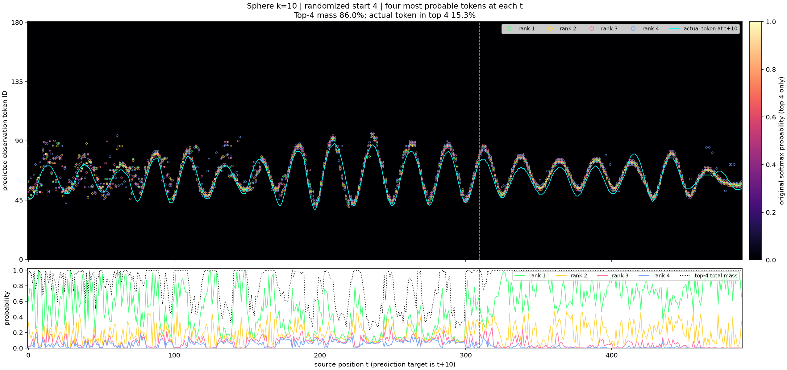

# Sphere k=10: four most probable token predictions

These four heatmaps show the saved transformer's **four highest-probability observation token IDs at every source position t**, predicting the token at **t+10**. They reuse the existing 500-token randomized-start evaluations without new inference, training, or GPU rental.

- Green, yellow, pink and blue circles identify ranks 1, 2, 3 and 4.
- Heatmap brightness is the original softmax probability of each selected token. All other bins are hidden. **The four probabilities are not renormalized**; omitted bins retain the remaining probability mass.
- Cyan is the actual observation at t+10. The lower panel shows the four individual probabilities and their total mass. Dashed line: sliding context begins after the 310-position native prefix.
- These are positionwise probability ranks. A color can switch token IDs or physical modes between positions; connecting the ranks would not establish four coherent generated trajectories. Selecting four observation bins also does not identify the four HMM actions.

The model is `sphere_polar_c11_n_up_gamma_constant_d0p14_a0p95_m16_d128l4h2mlp512_700m_seed0_k10`: n=20, gamma=0.35, delta_v=0.14, alpha=0.95, 181 observation bins, 699924480 training tokens, one training seed. Each evaluation has 500 observations, giving 490 k-ahead predictions. Starts use Gaussian jitter sigma=0.1 around the fixed training state; model context is 320, with a 310-token inference window. Full recipe, saved probabilities, weights/source verification and paired controls remain in [the original evaluation packet](../token-heatmaps-500-random-start/README.md).

## Results

| Randomized path | Mean probability mass in top four | Actual token in top four |
|---|---:|---:|
| 1 | 87.74% | 4.69% |
| 2 | 87.98% | 0.41% |
| 3 | 90.72% | 7.96% |
| 4 | 86.01% | 15.31% |

Across the four paths, the model assigns **88.11%** probability mass to these four bins on average, but they contain the actual target only **7.09%** of the time. This is evidence of confident errors in these randomized-start evaluations. Four paths and one training seed do not establish a population-level rate. The four neighboring highest-probability bins need not be four separate modes of the distribution.






## Verification and reproduction

`predictions.csv` contains all 7840 token predictions: path, source position, target position, actual token, rank, predicted token and original probability. `summary.json` retains source/configuration hashes, initial states and scores. Ties are broken by ascending token ID. `REMOTE_SHA256.json` records producer output hashes; `SHA256.json` covers the complete published packet.

The rendering job completed on staging-entity in 2.917 seconds, with a 12-GiB memory cap, no swap, a 180-second runtime limit, and 179.1 MiB peak memory. Every CSV row and reported score was independently checked against the saved full distributions.

```sh
python plot_top4.py --self-check
python verify.py
# Rendering needs NumPy and Matplotlib; verification only needs NumPy.
python plot_top4.py --input ../token-heatmaps-500-random-start --output /path/to/new-output
```
