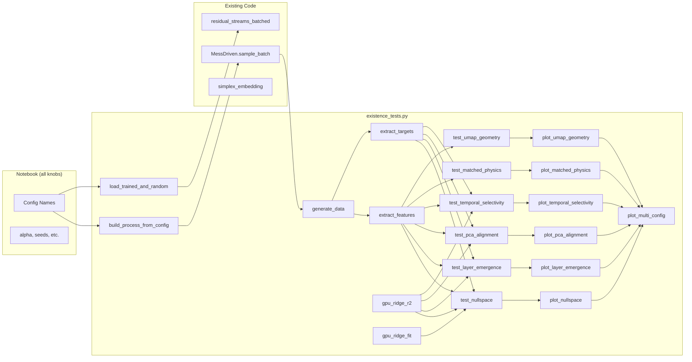

# Belief Existence Tests — Implementation Plan v2

## Problem & Context

Probe R² alone can't answer "does belief exist in residual stream?" Need converging evidence: null-space orthogonality, layer emergence, PCA concentration, temporal selectivity, matched-physics divergence, UMAP geometry.

**Two deliverables:**
1. [`experiments/pendulum-sweeps/existence_tests.py`](file:///home/manjot/Files/Code/BeliefPhysics/Belief-in-physics/experiments/pendulum-sweeps/existence_tests.py) — all test functions + plotting. **No hardcoded constants.** Every parameter is an argument.
2. [`experiments/pendulum-sweeps/existence_tests.ipynb`](file:///home/manjot/Files/Code/BeliefPhysics/Belief-in-physics/experiments/pendulum-sweeps/existence_tests.ipynb) — notebook: **all knobs and constants defined here**, passed into functions from the `.py` file. Full control over every value.

---

## Resolved Design Decisions

| Decision | Resolution |
|----------|-----------|
| Physics target for null-space (Test A) | `(theta_reconstructed, omega)` — 2D. Theta from `proc.undiscretise(tokens)`, omega from `batch["metric"]` |
| Default model width / horizon | `d_model=128`, `k_suffix="kn2"` (k=n_steps//2=5). Fallback to `"k1"` if kn2 missing |
| Default configs | 4: `gamma1_dv1.2_n10`, `gamma0.8_dv1.2_n10`, `gamma0.8_dv1_n10`, `gamma0.3_dv0.7_n10` |
| Test D data shaping | Per-position probe at relative position `t=k`. **Each probe pools all cycles**: X has shape `(N_traj * m, features)`, targets have shape `(N_traj * m, target_dim)`. Run `n_steps` probes total (t=0..9) |
| Test F neighbor search | KD-tree on normalized (theta, omega). Full 2048 trajectories |
| UMAP color scheme | Weighted blend of 4 fixed colors: `p0*#e74c3c + p1*#3498db + p2*#2ecc71 + p3*#f39c12` |
| Notebook style | Moderate: constants in cells, functions from `.py`. No widgets — just cell variables |
| Error bars | 3 data seeds (resample data with different `np.random.default_rng` seeds). For configs with 3 model seeds, also report model-seed variance |
| Random baseline | Fresh `TinyTransformer` with `seed + 99999`, same architecture. Created on-the-fly, matches `_worker.py` L723 pattern |
| Ridge alpha | Fixed `alpha=1.0` everywhere, passed as argument. No CV — keeps tests fast and deterministic |

---

## Codebase Architecture Reference

### Key existing modules

| Module | What it provides | Where used |
|--------|-----------------|------------|
| [`_worker.py`](file:///home/manjot/Files/Code/BeliefPhysics/Belief-in-physics/experiments/pendulum-sweeps/_worker.py) | `build_process()`, `LookaheadTransformer`, `SampledPhysicsSystem`, `extract_raw_targets()`, `extract_probe_features_and_targets()`, `_ridge_r2_gpu()`, `PROBE_MODES` | Feature extraction patterns, GPU ridge, model loading |
| [`analysis.py`](file:///home/manjot/Files/Code/BeliefPhysics/Belief-in-physics/models/analysis.py) | `residual_streams_batched()`, `tick_features()` | Getting residual streams from models |
| [`messk.py`](file:///home/manjot/Files/Code/BeliefPhysics/Belief-in-physics/physics/messk.py) | `MessDriven`, `MessKProcess`, `simplex_embedding()` | Process construction, belief computation |
| [`transformer.py`](file:///home/manjot/Files/Code/BeliefPhysics/Belief-in-physics/models/transformer.py) | `TinyTransformer`, `ModelConfig` | Model architecture, `residual_streams()` method |
| [`probe.py`](file:///home/manjot/Files/Code/BeliefPhysics/Belief-in-physics/models/probe.py) | `fit_probe()`, `AffineProbe` | CPU ridge baseline (not used — we do GPU) |

### Checkpoint structure

```
parallel_output/
  dt0.2_gamma{G}_dv{DV}_n{N}/
    d{W}_{k_suffix}_seed{S}_final.pt    ← state_dict
    d{W}_{k_suffix}_seed{S}_final.json  ← metadata (n_layers, d_mlp, k, etc.)
```

- `k_suffix` ∈ `{"k1", "kn2", "kn"}`. For n_steps=10: k1=1, kn2=5, kn=10
- Metadata JSON contains: `n_layers`, `n_heads`, `d_model`, `d_mlp`, `vocab_size`, `k`, `seed`, `seq_len`, `m`, etc.
- All models: `vocab_size=181`, `n_ctx=500` (=m*n_steps=50*10), `n_layers=4`, `n_heads=1`

### Data shapes from `proc.sample_batch(rng, N)`

```python
batch = {
    "tokens":     (N, 500),     # int64, 0..180
    "observable": (N, 500, 1),  # float64, theta values
    "metric":     (N, 500, 1),  # float64, omega values
    "beliefs":    (N, 500, 4),  # float64, P(next mood), constant within each cycle
    "moods":      (N, 500),     # int64, ground truth HMM state
    "letters":    (N, 50),      # int64, 0..3
    "states":     (N, 51),      # int64, mood sequence
}
```

- `n_steps=10` physics steps per cycle → `seq_len = m * n_steps = 50 * 10 = 500`
- Belief is constant within each cycle (10 consecutive positions share belief)
- `last_positions = np.arange(n_steps-1, seq_len, n_steps)` = `[9, 19, 29, ..., 499]` — tick-end positions

### Residual streams from `residual_streams_batched(model, tokens, device)`

Returns `list[np.ndarray]` of length `n_layers + 1 = 5`:
- `streams[0]`: embedding, shape `(N, 500, 128)` 
- `streams[1..4]`: post-block residual, shape `(N, 500, 128)`

All-layers concat: `np.concatenate(streams, axis=-1)` → `(N, 500, 640)`

---

## File Structure

### `existence_tests.py` — Function-level specification

```
existence_tests.py
├── IMPORTS
├── Section 1: Infrastructure
│   ├── build_process_from_config()
│   ├── load_model()
│   ├── load_trained_and_random()
│   ├── generate_data()
│   ├── sequence_split()
│   ├── gpu_ridge_fit()
│   ├── gpu_ridge_r2()
│   └── extract_features()
├── Section 2: Test Functions
│   ├── test_nullspace()           # Test A
│   ├── test_layer_emergence()     # Test B
│   ├── test_pca_alignment()       # Test C
│   ├── test_temporal_selectivity()# Test D
│   ├── test_matched_physics()     # Test F
│   └── test_umap_geometry()       # Test G
├── Section 3: Multi-seed Runners
│   └── run_test_multiseed()       # Wraps any test over multiple data seeds
├── Section 4: Plotting
│   ├── belief_color()             # 4-state weighted color blend
│   ├── plot_nullspace()
│   ├── plot_layer_emergence()
│   ├── plot_pca_alignment()
│   ├── plot_temporal_selectivity()
│   ├── plot_matched_physics()
│   ├── plot_umap_geometry()
│   └── plot_multi_config()        # Generic multi-config stacking layout
└── Section 5: Future TODOs (stubs)
    ├── test_cross_config_transfer()
    └── test_mutual_information()
```

---

## Detailed Function Specifications

### Section 1: Infrastructure

```python
# ---- imports ----
from __future__ import annotations
import json, sys, gc
from pathlib import Path
from dataclasses import dataclass
from typing import Any

import numpy as np
import torch
import matplotlib.pyplot as plt
import matplotlib.colors as mcolors
from scipy.spatial import cKDTree

ROOT = Path(__file__).resolve().parents[2]
if str(ROOT) not in sys.path:
    sys.path.insert(0, str(ROOT))
SWEEP_DIR = Path(__file__).resolve().parent

from models.analysis import residual_streams_batched
from models.transformer import ModelConfig, TinyTransformer
from physics.messk import MessDriven, MessKProcess, simplex_embedding
from physics.systems.pendulum import Pendulum
```

#### `build_process_from_config(config_name, output_dir)`

```python
def build_process_from_config(
    config_name: str,
    output_dir: Path,
) -> MessDriven:
    """Build MessDriven from the JSON sidecar of any checkpoint in config_dir.
    
    Reads the first .json found in config_dir to extract gamma, delta_v, dt,
    n_steps, m. Constructs Pendulum with SampledPhysicsSystem wrapper
    (integration_dt=0.01) matching _worker.py's build_process().
    
    Returns: MessDriven process
    """
    config_dir = output_dir / config_name
    meta_file = next(config_dir.glob("*.json"))
    meta = json.loads(meta_file.read_text())
    # Reuse _worker.build_process pattern:
    pendulum = Pendulum(gamma=meta["gamma"])
    # SampledPhysicsSystem wraps flow() with integration substeps
    # Must match _worker.py L48-60
    class _SampledPhysics:
        def __init__(self, base, integration_dt=0.01):
            self._base = base
            self._idt = integration_dt
        def __getattr__(self, name): return getattr(self._base, name)
        def flow(self, z, dt, substeps=1):
            n = round(dt / self._idt)
            return self._base.flow(z, dt, substeps=n * substeps)
    sampled = _SampledPhysics(pendulum)
    chain = MessKProcess(n_states=4, alpha=0.7, stay=0.7)
    return MessDriven(
        chain=chain, system=sampled,
        delta_v=meta["delta_v"], m=meta["m"],
        n_steps=meta["n_steps"], dt=meta["dt"], obs_bins=181,
    )
```

#### `load_model(config_dir, d_model, k_suffix, seed, device)`

```python
def load_model(
    config_dir: Path,
    d_model: int,
    k_suffix: str,
    seed: int,
    device: str,
) -> TinyTransformer:
    """Load a LookaheadTransformer checkpoint.
    
    Reads d{d_model}_{k_suffix}_seed{seed}_final.json for architecture,
    loads d{d_model}_{k_suffix}_seed{seed}_final.pt for weights.
    
    Returns model on device, eval mode.
    """
    meta = json.loads(
        (config_dir / f"d{d_model}_{k_suffix}_seed{seed}_final.json").read_text()
    )
    config = ModelConfig(
        vocab_size=meta["vocab_size"], n_ctx=meta["seq_len"],
        n_layers=meta["n_layers"], n_heads=meta.get("n_heads", 1),
        d_model=d_model, d_mlp=meta.get("d_mlp", 4 * d_model),
        seed=seed,
    )
    # LookaheadTransformer is just TinyTransformer — same state_dict
    # We don't need the loss() override for inference, so load as TinyTransformer
    model = TinyTransformer(config)
    state = torch.load(
        config_dir / f"d{d_model}_{k_suffix}_seed{seed}_final.pt",
        map_location=device,
    )
    model.load_state_dict(state)
    return model.to(device).eval()
```

> [!IMPORTANT]
> `LookaheadTransformer` subclass only overrides `loss()`. For inference (forward pass + `residual_streams()`), `TinyTransformer` works identically. Load as `TinyTransformer` to avoid importing `_worker.py`.

#### `load_trained_and_random(config_dir, d_model, k_suffix, seed, device)`

```python
def load_trained_and_random(
    config_dir: Path,
    d_model: int,
    k_suffix: str,
    seed: int,
    device: str,
) -> tuple[TinyTransformer, TinyTransformer]:
    """Load trained checkpoint + create fresh random model, same architecture.
    
    Random model uses seed + 99999 to ensure different init.
    Both returned in eval mode on device.
    """
    trained = load_model(config_dir, d_model, k_suffix, seed, device)
    # Random: same architecture, different seed
    random_config = ModelConfig(
        **{**trained.config.__dict__, "seed": seed + 99999}
    )
    random_model = TinyTransformer(random_config).to(device).eval()
    return trained, random_model
```

#### `generate_data(proc, n, seed)`

```python
def generate_data(
    proc: MessDriven,
    n: int,
    seed: int,
) -> dict:
    """Sample batch + precompute derived targets.
    
    Returns dict with original batch keys PLUS:
      "belief_coords": (N, seq_len, 3) — Helmert simplex coords
      "physics_state": (N, seq_len, 2) — (theta_reconstructed, omega)
    """
    batch = proc.sample_batch(np.random.default_rng(seed), n)
    belief_coords = batch["beliefs"] @ simplex_embedding(4)  # (N, seq_len, 3)
    # Reconstruct theta from tokens — undiscretise gives physical values
    theta = proc.undiscretise(batch["tokens"])[..., 0]  # (N, seq_len)
    omega = batch["metric"][..., 0]  # (N, seq_len)
    physics_state = np.stack([theta, omega], axis=-1)  # (N, seq_len, 2)
    return {**batch, "belief_coords": belief_coords, "physics_state": physics_state}
```

#### `sequence_split(n, train_frac, test_frac, seed)`

```python
def sequence_split(
    n: int,
    train_frac: float,
    test_frac: float,
    seed: int,
) -> tuple[np.ndarray, np.ndarray]:
    """Sequence-level train/test split. Returns (train_indices, test_indices).
    
    No validation split — alpha is fixed, no hyperparameter selection needed.
    """
    rng = np.random.default_rng(seed)
    order = rng.permutation(n)
    n_train = int(n * train_frac)
    return order[:n_train], order[n_train:]
```

#### `gpu_ridge_fit(X_train, y_train, alpha, device)` and `gpu_ridge_r2(...)`

```python
def gpu_ridge_fit(
    X_train: np.ndarray,
    y_train: np.ndarray,
    alpha: float,
    device: str,
) -> np.ndarray:
    """GPU ridge regression. Returns weight matrix W as numpy (d_features, d_targets).
    
    Solves (X^T X + alpha * I) W = X^T y via torch.linalg.solve.
    No centering — caller must center if needed.
    """
    Xt = torch.tensor(X_train, dtype=torch.float32, device=device)
    yt = torch.tensor(y_train, dtype=torch.float32, device=device)
    A = Xt.T @ Xt
    A.diagonal().add_(alpha)
    W = torch.linalg.solve(A, Xt.T @ yt)
    result = W.cpu().numpy()
    del Xt, yt, A, W
    return result


def gpu_ridge_r2(
    X_train: np.ndarray,
    y_train: np.ndarray,
    X_test: np.ndarray,
    y_test: np.ndarray,
    alpha: float,
    device: str,
) -> float:
    """Fit on train, score R² on test. All on GPU.
    
    Returns single float: mean per-column R², dropping zero-variance columns.
    Identical to _worker._ridge_r2_gpu but with per-column mean.
    """
    Xt = torch.tensor(X_train, dtype=torch.float32, device=device)
    yt = torch.tensor(y_train, dtype=torch.float32, device=device)
    Xv = torch.tensor(X_test, dtype=torch.float32, device=device)
    yv = torch.tensor(y_test, dtype=torch.float32, device=device)
    A = Xt.T @ Xt
    A.diagonal().add_(alpha)
    W = torch.linalg.solve(A, Xt.T @ yt)
    pred = Xv @ W
    ss_res = ((yv - pred) ** 2).sum(dim=0)
    ss_tot = ((yv - yv.mean(dim=0, keepdim=True)) ** 2).sum(dim=0)
    live = ss_tot > 1e-10
    r2_per_col = 1.0 - ss_res[live] / ss_tot[live]
    result = float(r2_per_col.mean()) if live.any() else float("nan")
    del Xt, yt, Xv, yv, A, W, pred
    return result
```

#### `extract_features(model, tokens, proc, mode, device, batch_size=64)`

```python
def extract_features(
    model: TinyTransformer,
    tokens: np.ndarray,
    proc: MessDriven,
    mode: str,
    device: str,
    batch_size: int = 64,
    layer: int | None = None,
) -> np.ndarray:
    """Extract features from residual stream in specified mode.
    
    Modes:
      "all_layers_single_token": all layers concat at tick-end positions
        → (N * m, n_layers_used * d_model)
      "all_layers_cycle": all layers concat, all positions in cycle concat
        → (N * m, n_layers_used * d_model * n_steps)
      "single_layer_all_tokens": one layer, all positions in cycle concat
        → (N * m, d_model * n_steps)
      "all_layers_per_position": all layers concat, single position in cycle
        → returns (N * m, n_layers_used * d_model) for a single position
        → requires `position` kwarg
      "all_tokens_flat": all layers concat, every position (not tick-aggregated)
        → (N * seq_len, n_layers_used * d_model)
    
    Args:
      layer: if not None, use only that layer index (0=embedding, 1..n_layers)
             otherwise use all layers
      
    Returns: 2D numpy array of features (float32)
    """
    streams = residual_streams_batched(model, tokens, device, batch_size=batch_size)
    # Apply layer selection
    if layer is not None:
        streams = [streams[layer]]
    
    n_steps = proc.n_steps
    m = proc.m
    last_positions = np.arange(n_steps - 1, proc.seq_len, n_steps)
    
    if mode == "all_layers_single_token":
        concat = np.concatenate(streams, axis=-1)  # (N, seq_len, L*d)
        return concat[:, last_positions, :].reshape(-1, concat.shape[-1]).astype(np.float32)
    
    elif mode == "all_layers_cycle":
        concat = np.concatenate(streams, axis=-1)  # (N, seq_len, L*d)
        N = concat.shape[0]
        per_cycle = concat.reshape(N, m, n_steps, -1)  # (N, m, n_steps, L*d)
        return per_cycle.reshape(N * m, -1).astype(np.float32)  # flatten n_steps*L*d
    
    elif mode == "single_layer_all_tokens":
        # layer must be set; use streams[0] which is the selected single layer
        s = streams[0]  # (N, seq_len, d)
        N = s.shape[0]
        per_cycle = s.reshape(N, m, n_steps, -1)
        return per_cycle.reshape(N * m, -1).astype(np.float32)
    
    elif mode == "all_tokens_flat":
        concat = np.concatenate(streams, axis=-1)
        return concat.reshape(-1, concat.shape[-1]).astype(np.float32)
    
    else:
        raise ValueError(f"Unknown mode: {mode}")
```

#### `extract_targets(data, proc, mode)`

```python
def extract_targets(
    data: dict,
    proc: MessDriven,
    mode: str,
) -> tuple[np.ndarray, np.ndarray]:
    """Extract belief and physics targets matched to feature mode.
    
    Returns: (belief_targets, physics_targets) both 2D numpy float32
    
    For tick-level modes (single_token, cycle, etc.):
      belief: (N*m, 3) — Helmert coords at tick-end
      physics: (N*m, 2) — (theta, omega) at tick-end
    
    For all_tokens_flat:
      belief: (N*seq_len, 3)
      physics: (N*seq_len, 2)
    """
    last = np.arange(proc.n_steps - 1, proc.seq_len, proc.n_steps)
    
    if mode in ("all_layers_single_token", "all_layers_cycle",
                "single_layer_all_tokens"):
        belief = data["belief_coords"][:, last, :].reshape(-1, 3)
        physics = data["physics_state"][:, last, :].reshape(-1, 2)
    elif mode == "all_tokens_flat":
        belief = data["belief_coords"].reshape(-1, 3)
        physics = data["physics_state"].reshape(-1, 2)
    else:
        raise ValueError(f"Unknown mode: {mode}")
    return belief.astype(np.float32), physics.astype(np.float32)
```

---

### Section 2: Test Functions

#### Test A — Null-Space Probing

```python
def test_nullspace(
    model: TinyTransformer,
    data: dict,
    proc: MessDriven,
    mode: str,
    alpha: float,
    train_frac: float,
    device: str,
    split_seed: int,
    batch_size: int = 64,
) -> dict:
    """Null-space probing: does belief survive after projecting out physics?
    
    Steps:
      1. Extract features X in `mode`
      2. Extract physics targets y_phys = (theta, omega)
      3. Extract belief targets y_bel = Helmert coords
      4. Split sequences into train/test
      5. Fit physics probe: W_phys = gpu_ridge_fit(X_train, y_phys_train, alpha)
      6. QR decompose W_phys → Q (orthonormal basis of physics subspace)
         Q, _ = np.linalg.qr(W_phys)  # W_phys is (d_features, 2) → Q is (d_features, 2)
      7. Project to null space: X_null = X - X @ Q @ Q.T
      8. Probe X for belief (full): full_belief_r2
      9. Probe X_null for belief: null_belief_r2
      10. Probe X for physics: physics_r2
    
    Returns: {
        "full_belief_r2": float,
        "null_belief_r2": float,  # THE KEY NUMBER
        "physics_r2": float,
        "feature_dim": int,
        "null_feature_dim": int,  # = feature_dim - 2
        "n_train": int,
        "n_test": int,
    }
    """
```

> [!IMPORTANT]
> **The QR step**: `W_phys` is `(d_features, 2)`. `np.linalg.qr(W_phys)` gives `Q` of shape `(d_features, 2)`. `X_null = X - X @ Q @ Q.T` projects out only 2 directions. The remaining `d_features - 2` dimensional subspace is probed for belief. If `null_belief_r2 > 0` meaningfully (say >0.05), belief is orthogonal to physics.

#### Test B — Layer Emergence

```python
def test_layer_emergence(
    model: TinyTransformer,
    data: dict,
    proc: MessDriven,
    variation: str,
    alpha: float,
    train_frac: float,
    device: str,
    split_seed: int,
    batch_size: int = 64,
) -> list[dict]:
    """Per-layer R² curves.
    
    Args:
      variation: "all_tokens" | "cycle_concat" | "last_token"
    
    For each layer L in [0 (embedding), 1, 2, 3, 4]:
      Extract features using only layer L in the specified variation
      Fit ridge → belief R², physics R²
    
    Then one more entry: all layers concatenated (same variation)
    
    Feature shapes per (layer, variation):
      ("all_tokens", single layer):   (N * seq_len, d_model)
      ("cycle_concat", single layer): (N * m, n_steps * d_model)
      ("last_token", single layer):   (N * m, d_model)
      ("all_tokens", all layers):     (N * seq_len, (n_layers+1) * d_model)
      etc.
    
    Returns: list of dicts, each:
      {"layer": "emb"|"L1"|...|"all", "belief_r2": float, "physics_r2": float}
    """
```

**Variation mapping to `extract_features`:**

| `variation` | Per-layer mode | Target mode |
|------------|---------------|-------------|
| `"all_tokens"` | `extract_features(layer=L, mode="all_tokens_flat")` | `extract_targets(mode="all_tokens_flat")` |
| `"cycle_concat"` | `extract_features(layer=L, mode="single_layer_all_tokens")` | `extract_targets(mode="all_layers_cycle")` |
| `"last_token"` | `extract_features(layer=L, mode="all_layers_single_token")` | `extract_targets(mode="all_layers_single_token")` |

For the "all layers" entry: use `layer=None` with the corresponding mode.

#### Test C — PCA Alignment

```python
def test_pca_alignment(
    model: TinyTransformer,
    data: dict,
    proc: MessDriven,
    feature_config: str,
    alpha: float,
    train_frac: float,
    device: str,
    split_seed: int,
    max_pcs: int,
    batch_size: int = 64,
) -> dict:
    """Cumulative R² as a function of number of PCs used.
    
    Args:
      feature_config: "all_layers_cycle" | "all_layers_single_token" | "single_layer_all_tokens"
      max_pcs: maximum number of PCs to test (e.g. 50)
    
    Steps:
      1. Extract features X
      2. Center X (subtract mean)
      3. Compute PCA via SVD: U, S, Vt = np.linalg.svd(X_centered, full_matrices=False)
         — Expensive for large matrices. Use randomized SVD if d > 500:
           from sklearn.utils.extmath import randomized_svd
      4. For k = 1, 2, 5, 10, 15, 20, 30, 40, 50 (up to max_pcs):
           X_projected = X_centered @ Vt[:k].T  # (n_samples, k)
           belief_r2 = gpu_ridge_r2(X_proj_train, y_bel_train, X_proj_test, y_bel_test, alpha)
           physics_r2 = same for physics
      5. Return arrays for plotting
    
    Returns: {
        "n_pcs": [1, 2, 5, ...],
        "belief_r2": [float, ...],
        "physics_r2": [float, ...],
        "explained_variance_ratio": [float, ...],  # cumulative
        "total_feature_dim": int,
    }
    """
```

> [!IMPORTANT]
> For `"all_layers_cycle"` with d_model=128, n_layers=5, n_steps=10: feature dim = 640 * 10 = 6400. SVD on `(N*m, 6400)` matrix — use `sklearn.utils.extmath.randomized_svd` with `n_components=max_pcs` to avoid full SVD.

#### Test D — Temporal Selectivity

```python
def test_temporal_selectivity(
    model: TinyTransformer,
    data: dict,
    proc: MessDriven,
    alpha: float,
    train_frac: float,
    device: str,
    split_seed: int,
    batch_size: int = 64,
) -> dict:
    """R² as a function of position within a cycle.
    
    For each relative position t = 0, 1, ..., n_steps-1:
      - positions_t = [t, t + n_steps, t + 2*n_steps, ...] — position t in every cycle
      - X = all-layers-concat residual stream at positions_t → (N * m, (n_layers+1)*d_model)
      - y_bel = belief at cycle that position t belongs to → (N * m, 3)
        Note: belief is CONSTANT within a cycle, so y_bel is the same for t=0..9
      - y_phys = (theta, omega) at position t → (N * m, 2)
      - Fit ridge → R²
    
    Returns: {
        "positions": [0, 1, ..., n_steps-1],
        "belief_r2": [float, ...],  # length n_steps
        "physics_r2": [float, ...],
    }
    """
```

**Critical detail**: belief target is the SAME for all positions in a cycle (belief updates once per kick, not per physics step). Physics target varies per position. So belief R² gradient reveals whether the model's **representation** changes within a cycle even though the **target** doesn't.

Implementation:
```python
streams = residual_streams_batched(model, data["tokens"], device, batch_size=batch_size)
concat = np.concatenate(streams, axis=-1)  # (N, seq_len, L*d)
N, seq_len, d = concat.shape
n_steps, m = proc.n_steps, proc.m

train_idx, test_idx = sequence_split(N, train_frac, 1.0 - train_frac, split_seed)

results = {"positions": [], "belief_r2": [], "physics_r2": []}
for t in range(n_steps):
    # Positions of step t in every cycle
    positions_t = np.arange(t, seq_len, n_steps)  # length m
    X = concat[:, positions_t, :].reshape(-1, d)  # (N*m, L*d)
    
    # Belief target at this cycle (constant within cycle)
    y_bel = data["belief_coords"][:, positions_t, :].reshape(-1, 3)
    # Physics at this exact position
    y_phys = data["physics_state"][:, positions_t, :].reshape(-1, 2)
    
    # Split — expand sequence indices to tick indices
    tr = np.concatenate([train_idx * m + c for c in range(m)])
    te = np.concatenate([test_idx * m + c for c in range(m)])
    
    bel_r2 = gpu_ridge_r2(X[tr], y_bel[tr], X[te], y_bel[te], alpha, device)
    phys_r2 = gpu_ridge_r2(X[tr], y_phys[tr], X[te], y_phys[te], alpha, device)
    results["positions"].append(t)
    results["belief_r2"].append(bel_r2)
    results["physics_r2"].append(phys_r2)

del streams, concat
gc.collect()
return results
```

#### Test F — Matched-Physics Divergence

```python
def test_matched_physics(
    model: TinyTransformer,
    data: dict,
    proc: MessDriven,
    cycle_range: tuple[int, int],
    epsilon: float,
    belief_threshold: float,
    device: str,
    batch_size: int = 64,
) -> dict:
    """Find timesteps where physics matches but belief differs, compare residual streams.
    
    Args:
      cycle_range: (start_cycle, end_cycle) e.g. (30, 45) — late cycles where
                   belief has diverged from prior
      epsilon: normalized distance threshold for "same physics" (e.g. 0.02)
      belief_threshold: minimum L1 distance in belief for "different belief" (e.g. 0.3)
    
    Steps:
      1. Extract residual streams, all-layers-concat at tick-end positions
         within cycle_range → (N * n_cycles, L*d_model)
      2. Extract physics_state at same positions → (N * n_cycles, 2)
      3. Normalize physics to [0, 1] per dimension
      4. Build KD-tree on normalized physics
      5. Query pairs within epsilon L∞ ball
      6. Filter: keep pairs where belief L1 > belief_threshold
      7. Compute L2 of residual stream difference for matched pairs
      8. Random control: L2 of residual stream for random unmatched pairs
    
    Returns: {
        "n_matched_pairs": int,
        "matched_resid_l2": np.ndarray,   # L2 distances for matched pairs
        "control_resid_l2": np.ndarray,    # L2 distances for random pairs
        "matched_belief_l1": np.ndarray,   # belief L1 for matched pairs
        "matched_physics_linf": np.ndarray, # physics L∞ for matched pairs
        "mean_matched_l2": float,
        "mean_control_l2": float,
    }
    """
```

**KD-tree implementation detail:**
```python
# Normalize physics
theta_range = proc.obs_ranges[0]  # (-pi/2, pi/2)
omega_range = (-proc.system.omega_max, proc.system.omega_max)
phys_norm = np.column_stack([
    (theta - theta_range[0]) / (theta_range[1] - theta_range[0]),
    (omega - omega_range[0]) / (omega_range[1] - omega_range[0]),
])

tree = cKDTree(phys_norm)
# query_ball_tree with p=np.inf gives L∞ ball
pairs = tree.query_pairs(r=epsilon, p=np.inf)
```

#### Test G — UMAP Geometry

```python
def test_umap_geometry(
    model: TinyTransformer,
    data: dict,
    proc: MessDriven,
    feature_config: str,
    n_epochs: int,
    n_neighbors: int,
    min_dist: float,
    seed: int,
    max_points: int,
) -> dict:
    """UMAP dimensionality reduction of residual stream, colored by belief.
    
    Args:
      feature_config: "all_layers_cycle" | "all_layers_single_token" | "single_layer_all_tokens"
      n_epochs: UMAP training epochs (e.g. 20)
      n_neighbors: UMAP neighbor count (e.g. 15)
      min_dist: UMAP minimum distance (e.g. 0.1)
      max_points: subsample to this many points for UMAP (e.g. 5000)
    
    Returns: {
        "embedding": (n_points, 2),  # UMAP coordinates
        "beliefs": (n_points, 4),    # ground-truth belief for coloring
        "moods": (n_points,),        # argmax mood for AMI computation
    }
    """
    import umap
    
    X = extract_features(model, data["tokens"], proc, feature_config, device, ...)
    belief_targets, _ = extract_targets(data, proc, feature_config)
    
    # Subsample
    if len(X) > max_points:
        rng = np.random.default_rng(seed)
        idx = rng.choice(len(X), max_points, replace=False)
        X, belief_targets = X[idx], belief_targets[idx]
    
    reducer = umap.UMAP(
        n_components=2, n_epochs=n_epochs,
        n_neighbors=n_neighbors, min_dist=min_dist,
        random_state=seed,
    )
    embedding = reducer.fit_transform(X.astype(np.float32))
    
    # Reconstruct full belief probs from Helmert coords
    # belief_targets is (N, 3) Helmert → invert to get (N, 4) probs
    H = simplex_embedding(4)  # (4, 3)
    # b @ H = coords → b = coords @ pinv(H) + 1/4
    H_pinv = np.linalg.pinv(H)  # (3, 4)
    beliefs = belief_targets @ H_pinv + 0.25  # (N, 4)
    beliefs = np.clip(beliefs, 0, None)
    beliefs /= beliefs.sum(axis=1, keepdims=True)
    
    return {
        "embedding": embedding,
        "beliefs": beliefs,
        "moods": beliefs.argmax(axis=1),
    }
```

---

### Section 3: Multi-Seed Runner

```python
def run_test_multiseed(
    test_fn,
    test_kwargs: dict,
    data_seeds: list[int],
    proc: MessDriven,
    n_data: int,
) -> list[dict]:
    """Run any test function across multiple data seeds.
    
    For each seed:
      1. Generate fresh data with that seed
      2. Run test_fn(**test_kwargs, data=fresh_data)
      3. Collect results
    
    Returns: list of result dicts (one per seed)
    """
    results = []
    for seed in data_seeds:
        data = generate_data(proc, n_data, seed)
        result = test_fn(data=data, proc=proc, **test_kwargs)
        results.append(result)
        gc.collect()
        if torch.cuda.is_available():
            torch.cuda.empty_cache()
    return results
```

---

### Section 4: Plotting

#### Color blending

```python
STATE_COLORS = np.array([
    [0.906, 0.298, 0.235, 1.0],  # #e74c3c red
    [0.204, 0.596, 0.859, 1.0],  # #3498db blue
    [0.180, 0.800, 0.443, 1.0],  # #2ecc71 green
    [0.953, 0.612, 0.071, 1.0],  # #f39c12 amber
])

def belief_colors(beliefs: np.ndarray) -> np.ndarray:
    """(N, 4) belief probs → (N, 4) RGBA colors via weighted blend."""
    return beliefs @ STATE_COLORS  # (N, 4) @ (4, 4) → (N, 4) RGBA
```

#### Multi-config stacking layout

```python
def plot_multi_config(
    results: dict[str, Any],  # config_name → test results
    plot_fn,                   # callable(ax_row, config_name, result)
    n_plots_per_config: int,
    max_cols: int,
    figsize_per_subplot: tuple[float, float],
    title: str,
) -> plt.Figure:
    """Generic layout: configs stacked vertically, plots horizontal.
    
    Each config gets ceil(n_plots_per_config / max_cols) rows.
    Total rows = n_configs * rows_per_config.
    Total cols = min(n_plots_per_config, max_cols).
    
    plot_fn(axes, config_name, result, config_index) draws into axes (1D array of Axes).
    """
    n_configs = len(results)
    n_cols = min(n_plots_per_config, max_cols)
    rows_per_config = -(-n_plots_per_config // n_cols)  # ceil division
    n_rows = n_configs * rows_per_config
    
    fig, all_axes = plt.subplots(
        n_rows, n_cols,
        figsize=(figsize_per_subplot[0] * n_cols, figsize_per_subplot[1] * n_rows),
        squeeze=False,
    )
    
    for i, (config_name, result) in enumerate(results.items()):
        row_start = i * rows_per_config
        axes = all_axes[row_start:row_start + rows_per_config].flatten()
        plot_fn(axes, config_name, result, i)
        # Hide unused axes
        for j in range(n_plots_per_config, len(axes)):
            axes[j].set_visible(False)
    
    fig.suptitle(title, fontsize=14, y=1.02)
    fig.tight_layout()
    return fig
```

#### Per-test plot functions (signatures)

```python
def plot_nullspace(axes, config_name, results_by_seed, config_idx):
    """2 grouped bar charts: trained (left), random (right).
    Each bar chart: full_belief_r2, null_belief_r2, physics_r2.
    Error bars from seed variance."""

def plot_layer_emergence(axes, config_name, results_by_seed, config_idx):
    """2 line plots: trained (left), random (right).
    3 curves per plot (one per variation: all_tokens, cycle_concat, last_token).
    X-axis: emb, L1, L2, L3, L4, all. Y-axis: R².
    Error bars = shaded region from seed std."""

def plot_pca_alignment(axes, config_name, results_by_seed, config_idx):
    """3 line plots (one per feature_config).
    Each plot: trained vs random curve. X: #PCs. Y: cumulative R².
    Error bars = shaded region."""

def plot_temporal_selectivity(axes, config_name, results_by_seed, config_idx):
    """2 line plots: belief R² (left), physics R² (right).
    X: position in cycle (0..9). Y: R².
    Error bars from seeds."""

def plot_matched_physics(axes, config_name, results_by_seed, config_idx):
    """2 plots: histogram overlay (matched vs control L2 distances) (left),
    summary stats bar chart (right).
    Error bars from seeds on the summary stats."""

def plot_umap_geometry(axes, config_name, results_by_seed, config_idx):
    """3 scatter plots (one per feature_config).
    Points colored by belief_colors().
    Different seeds shown as different point markers or separate panels."""
```

---

## Figure Layout Summary

| Test | Plots per config | Layout per config | With 4 configs |
|------|-----------------|-------------------|----------------|
| A: Null-space | 2 (trained, random) | 1 row × 2 cols | 4 rows × 2 cols |
| B: Layer emergence | 2 (trained, random) | 1 row × 2 cols | 4 rows × 2 cols |
| C: PCA alignment | 3 (one per feature config) | 1 row × 3 cols | 4 rows × 3 cols |
| D: Temporal | 2 (belief, physics) | 1 row × 2 cols | 4 rows × 2 cols |
| F: Matched-physics | 2 (histogram, summary) | 1 row × 2 cols | 4 rows × 2 cols |
| G: UMAP | 3 (one per feature config) | 1 row × 3 cols | 4 rows × 3 cols |

---

## Notebook Structure

```python
# Cell 1: Imports + Paths
import sys; sys.path.insert(0, str(Path("../..").resolve()))
from experiments.pendulum_sweeps.existence_tests import *

# Cell 2: Configuration — ALL KNOBS HERE
OUTPUT_DIR = Path("parallel_output")
CONFIGS = [
    "dt0.2_gamma1_dv1.2_n10",
    "dt0.2_gamma0.8_dv1.2_n10",
    "dt0.2_gamma0.8_dv1_n10",
    "dt0.2_gamma0.3_dv0.7_n10",
]
D_MODEL = 128
K_SUFFIX = "kn2"
MODEL_SEED = 0
N_DATA = 1024
DATA_SEEDS = [42, 137, 2024]
TRAIN_FRAC = 0.8
RIDGE_ALPHA = 1.0
DEVICE = "cuda" if torch.cuda.is_available() else "cpu"
BATCH_SIZE = 64

# Cell 3: Load models + data (cached)
models = {}    # config_name → (trained, random)
processes = {} # config_name → MessDriven
datasets = {}  # config_name → {seed: data_dict}
for cfg in CONFIGS:
    processes[cfg] = build_process_from_config(cfg, OUTPUT_DIR)
    config_dir = OUTPUT_DIR / cfg
    models[cfg] = load_trained_and_random(config_dir, D_MODEL, K_SUFFIX, MODEL_SEED, DEVICE)
    datasets[cfg] = {s: generate_data(processes[cfg], N_DATA, s) for s in DATA_SEEDS}

# Cell 4: Test A — Null-Space Probing
NULLSPACE_MODES = ["all_layers_single_token", "all_layers_cycle"]
# ... run and plot ...

# Cell 5: Test B — Layer Emergence
LAYER_VARIATIONS = ["all_tokens", "cycle_concat", "last_token"]
# ...

# Cell 6: Test C — PCA Alignment
PCA_FEATURE_CONFIGS = ["all_layers_cycle", "all_layers_single_token", "single_layer_all_tokens"]
PCA_MAX_PCS = 50
# ...

# Cell 7: Test D — Temporal Selectivity
# ...

# Cell 8: Test G — UMAP Geometry
UMAP_FEATURE_CONFIGS = ["all_layers_cycle", "all_layers_single_token", "single_layer_all_tokens"]
UMAP_N_EPOCHS = 20
UMAP_N_NEIGHBORS = 15
UMAP_MIN_DIST = 0.1
UMAP_MAX_POINTS = 5000
# ...

# Cell 9: Test F — Matched-Physics Divergence
MATCHED_N_DATA = 2048
MATCHED_CYCLE_RANGE = (30, 45)
MATCHED_EPSILON = 0.02
MATCHED_BELIEF_THRESHOLD = 0.3
# ...
```

---

## Task Checklist

> [!IMPORTANT]
> Follow these steps **in order**. Each step has a verification criterion. Do NOT skip steps. Do NOT hardcode any constant in the `.py` file — every number comes from function arguments.

### Phase 0: Setup

- [ ] **0.1** Add `"umap-learn>=0.5.7"` to [`pyproject.toml`](file:///home/manjot/Files/Code/BeliefPhysics/Belief-in-physics/pyproject.toml) `dependencies` list. Run `uv sync` to install.
- [ ] **0.2** Verify: `uv run python -c "import umap; print('ok')"` exits 0.

### Phase 1: Infrastructure (`existence_tests.py`)

- [ ] **1.1** Create [`experiments/pendulum-sweeps/existence_tests.py`](file:///home/manjot/Files/Code/BeliefPhysics/Belief-in-physics/experiments/pendulum-sweeps/existence_tests.py). Add imports block exactly as specified in Section 1 above. Ensure `ROOT` and `SWEEP_DIR` paths work.
- [ ] **1.2** Implement `build_process_from_config()`. The `SampledPhysicsSystem` wrapper MUST match [`_worker.py` L48-60](file:///home/manjot/Files/Code/BeliefPhysics/Belief-in-physics/experiments/pendulum-sweeps/_worker.py#L48-L60) behavior (wraps `Pendulum.flow()` with integration substeps). Test: build process for `"dt0.2_gamma1_dv1.2_n10"` and verify `proc.seq_len == 500`, `proc.n_obs == 181`, `proc.m == 50`, `proc.n_steps == 10`.
- [ ] **1.3** Implement `load_model()`. Load state dict into `TinyTransformer` (NOT `LookaheadTransformer` — it's the same for inference). Read architecture from JSON sidecar. Test: load a d128 kn2 seed0 model, run `model.residual_streams(torch.randint(0, 181, (2, 500)).to(DEVICE))` and check output is list of 5 arrays of shape `(2, 500, 128)`.
- [ ] **1.4** Implement `load_trained_and_random()`. Random model uses `ModelConfig(seed=seed + 99999)`. Test: both returned models produce different residual streams on same input.
- [ ] **1.5** Implement `generate_data()`. Must produce `"belief_coords"` via `batch["beliefs"] @ simplex_embedding(4)` and `"physics_state"` via `proc.undiscretise(tokens)[..., 0]` for theta + `batch["metric"][..., 0]` for omega. Test: shapes `belief_coords=(N, 500, 3)`, `physics_state=(N, 500, 2)`.
- [ ] **1.6** Implement `sequence_split()`. Simple permutation + cutoff. No validation split.
- [ ] **1.7** Implement `gpu_ridge_fit()` and `gpu_ridge_r2()`. Must delete GPU tensors after use (`del` + return). Match [`_worker.py` L283-295](file:///home/manjot/Files/Code/BeliefPhysics/Belief-in-physics/experiments/pendulum-sweeps/_worker.py#L283-L295) pattern. Test: on known linear relationship, R² > 0.99.
- [ ] **1.8** Implement `extract_features()` with ALL modes: `"all_layers_single_token"`, `"all_layers_cycle"`, `"single_layer_all_tokens"`, `"all_tokens_flat"`. Plus `layer` kwarg for single-layer selection. Test all modes produce expected shapes:
  - `all_layers_single_token`, layer=None: `(N*50, 640)` for d128, 5 layers
  - `all_layers_cycle`, layer=None: `(N*50, 6400)`
  - `single_layer_all_tokens`, layer=4: `(N*50, 1280)`
  - `all_tokens_flat`, layer=None: `(N*500, 640)`
- [ ] **1.9** Implement `extract_targets()`. Test: shapes match `extract_features()` row counts for same mode.

### Phase 2: Test Functions

- [ ] **2.1** Implement `test_nullspace()`. Key steps: (a) gpu_ridge_fit for physics → W_phys, (b) QR on W_phys → Q, (c) null projection `X_null = X - X @ Q @ Q.T`, (d) gpu_ridge_r2 on X_null for belief. Return dict with `full_belief_r2`, `null_belief_r2`, `physics_r2`. Test: on random model, `null_belief_r2` should be near 0 or very low.
- [ ] **2.2** Implement `test_layer_emergence()`. Loop over layers 0..n_layers, plus "all" entry. For each layer, use `extract_features(layer=L, ...)` with appropriate mode mapping. Return list of dicts. Test: list has 6 entries (emb + 4 layers + all).
- [ ] **2.3** Implement `test_pca_alignment()`. Use `sklearn.utils.extmath.randomized_svd` when feature_dim > max_pcs to avoid full SVD. PC counts to test: `[1, 2, 3, 5, 10, 15, 20, 30, 40, 50]` filtered by `<= max_pcs`. Test: R² monotonically non-decreasing with more PCs.
- [ ] **2.4** Implement `test_temporal_selectivity()`. Loop `t = 0..n_steps-1`. For each `t`: positions `= np.arange(t, seq_len, n_steps)`, extract features at those positions, probe for belief and physics. Expand train/test sequence indices to tick-level indices correctly. Test: returns dict with `n_steps` entries.
- [ ] **2.5** Implement `test_matched_physics()`. Steps: (a) extract features at tick-end positions within `cycle_range`, (b) extract and normalize physics, (c) build `cKDTree`, (d) `query_pairs(r=epsilon, p=np.inf)`, (e) filter by belief L1 > threshold, (f) compute L2 of residual stream differences, (g) sample equal number of random (unmatched) pairs for control. Test: runs without error on 512 trajectories, returns at least some matched pairs.
- [ ] **2.6** Implement `test_umap_geometry()`. Import `umap` at function call time (lazy). Subsample to `max_points`. Reconstruct full belief probs from Helmert coords via pseudoinverse. Test: embedding shape is `(min(N*m, max_points), 2)`.

### Phase 3: Multi-Seed Runner

- [ ] **3.1** Implement `run_test_multiseed()`. Takes any test function + kwargs, runs with different data seeds. Calls `gc.collect()` + `torch.cuda.empty_cache()` between seeds. Test: returns list of length `len(data_seeds)`.

### Phase 4: Plotting

- [ ] **4.1** Implement `belief_colors()`. `STATE_COLORS` as module-level constant (RGBA float array). Test: `belief_colors(np.array([[1,0,0,0]]))` returns the red RGBA.
- [ ] **4.2** Implement `plot_multi_config()`. Generic subplot stacking. Test: with 4 configs and 3 plots each, creates figure with 4 rows × 3 cols.
- [ ] **4.3** Implement `plot_nullspace()`. Grouped bar chart. Bars: `full_belief_r2`, `null_belief_r2`, `physics_r2`. Error bars from seed std. Two groups: trained, random. Config name as row label.
- [ ] **4.4** Implement `plot_layer_emergence()`. Line plot. X = `["emb", "L1", "L2", "L3", "L4", "all"]`. 3 curves per plot (one per variation), each with shaded error band. Two subplots side-by-side: trained, random.
- [ ] **4.5** Implement `plot_pca_alignment()`. Line plot. X = #PCs (log scale helpful). Y = R². Two curves per plot (trained, random). Three subplots per config (one per feature_config). Shaded error band.
- [ ] **4.6** Implement `plot_temporal_selectivity()`. Line plot. X = position (0..9). Two subplots: belief, physics. Shaded error band.
- [ ] **4.7** Implement `plot_matched_physics()`. Subplot 1: overlaid histograms (matched L2 vs control L2, different colors, alpha=0.5). Subplot 2: bar chart of mean ± std for matched vs control.
- [ ] **4.8** Implement `plot_umap_geometry()`. Scatter plot, `belief_colors()` for point color, `s=3`, `alpha=0.6`. Three subplots per config (one per feature_config). Add `plt.colorbar`-like legend showing the 4 state colors.

### Phase 5: Notebook

- [ ] **5.1** Create [`experiments/pendulum-sweeps/existence_tests.ipynb`](file:///home/manjot/Files/Code/BeliefPhysics/Belief-in-physics/experiments/pendulum-sweeps/existence_tests.ipynb). Cell 1: imports. Cell 2: ALL constants (listed in Notebook Structure above). Cell 3: model + data loading loop.
- [ ] **5.2** Cell 4 (Test A): for each config, for each data seed, run `test_nullspace()` in both modes. Pass results to `plot_multi_config()` with `plot_nullspace`.
- [ ] **5.3** Cell 5 (Test B): for each config, for each data seed, run `test_layer_emergence()` for all 3 variations. Plot via `plot_layer_emergence`.
- [ ] **5.4** Cell 6 (Test C): for each config, for each data seed, run `test_pca_alignment()` for all 3 feature configs. Plot via `plot_pca_alignment`.
- [ ] **5.5** Cell 7 (Test D): for each config, for each data seed, run `test_temporal_selectivity()`. Plot via `plot_temporal_selectivity`.
- [ ] **5.6** Cell 8 (Test G): for each config, for each data seed, run `test_umap_geometry()` for all 3 feature configs. Plot via `plot_umap_geometry`. Note: UMAP is slow — use `max_points=5000`.
- [ ] **5.7** Cell 9 (Test F): for each config, generate fresh data with `n=2048` trajectories (not reusing the smaller dataset), run `test_matched_physics()`. Plot via `plot_matched_physics`.
- [ ] **5.8** Cell 10: summary table as a pandas DataFrame showing all test results across configs.

### Phase 6: Verification

- [ ] **6.1** Run the full notebook on a single config (`gamma0.3_dv0.7_n10`, which has 3 model seeds) to verify all tests execute without error.
- [ ] **6.2** Verify: Test A `null_belief_r2` for trained model > 0 (ideally > 0.05). For random model, should be near 0.
- [ ] **6.3** Verify: Test B layer emergence curve for trained model shows belief R² increasing from layer 0 to layer 4. Physics R² should be non-trivial at layer 0.
- [ ] **6.4** Verify: Test C PCA curve for trained model saturates faster than for random model.
- [ ] **6.5** Verify: Test D belief R² increases across positions 0→9 within a cycle for trained model.
- [ ] **6.6** Verify: Test G UMAP for trained model shows visible clusters; for random model shows uniform cloud.
- [ ] **6.7** Verify: Test F `mean_matched_l2` > `mean_control_l2` (model encodes something beyond physics). If not enough matched pairs found, reduce epsilon or increase n_trajectories.

---

## Data Flow Diagram



